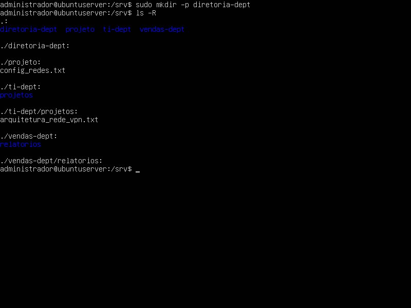
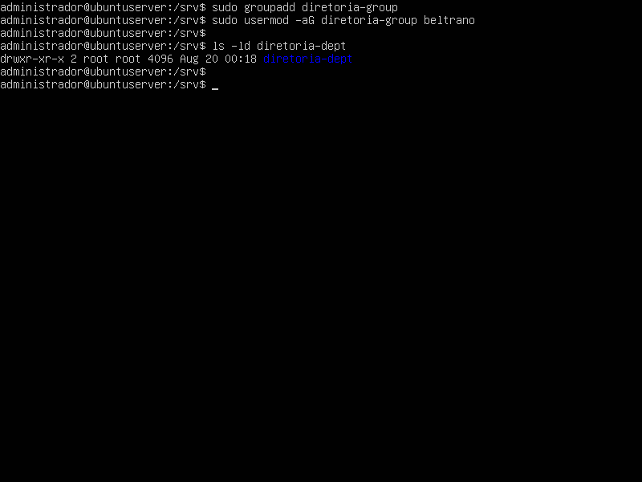
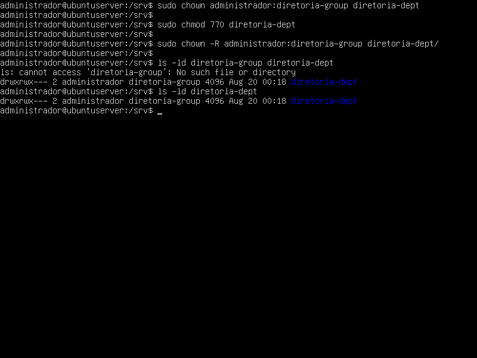
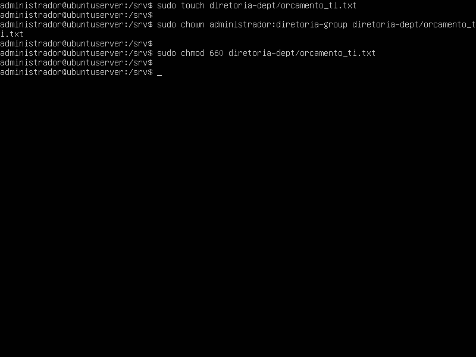
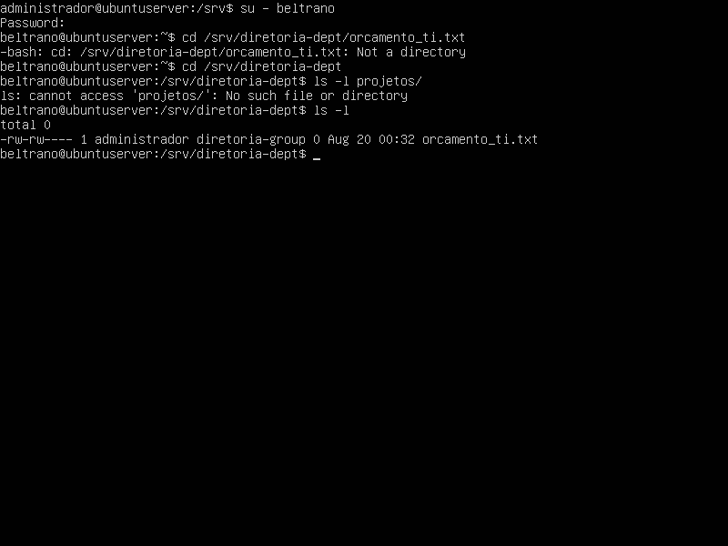
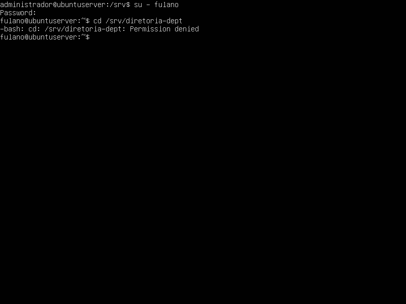

## 1. Identificação
* **Disciplina:** Laboratório de Sistemas Operacionais e Redes (LSOR)
* **Curso:** Bacharelado em Sistemas de Informação (BSI)
* **Repositório:** `labredes-bsi-2026.02`
* **Estudante:** José Pedro Costa Duda
* **Data da Execução:** 19/08/2026

---

## 2. Objetivo
Como objetivos principais dessa prática estão: Reconhecer e navegar entre pastas e diretórios do sistema, conhecer os principais diretórios e suas funções no Linux, criar diretórios aninhados e testar as restrições de acesso já estudadas.

---

## 3. Ambiente do Laboratório

* **Computador Host:**
  * **Sistema Operacional:** Windows
  * **Caminho da VM:** `C:\2026\BSI\VM\José Pedro Costa Duda\ubuntu_server`
  * **Arquivo ISO Utilizado:** `ubuntu-26.04-live-server-amd64.iso`
* **Máquina Virtual:**
  * **Software de Virtualização:** Oracle VM VirtualBox
  * **Nome da VM:** `ubuntu_server`
  * **Memória RAM:** 2048 MB
  * **CPU:** 1 CPU
  * **Disco Virtual:** 32 GB (VDI, Dinamicamente Alocado)

---

## 4. Procedimento Realizado

1. **Criação do diretório:** Nesta etapa foi realizada a criação do diretório ‘/diretoria-dept’ na pasta ‘/srv’ para o exercício do laboratório.

2. **Grupo de usuários:** Criado o grupo ‘diretoria-group’ e adicionado o usuário beltrano. 

3. **Atribuição de usuários:** Atribuído o diretório ‘/srv/diretoria-dept’ e o grupo de usuários ‘diretoria-group’ ao Administrador.  

4. **Permissões de usuário:** Atribuído o controle total do diretório ‘srv/diretoria-dept’, através da regra octal, para restringir acessos e manipular arquivos.

5. **Arquivo para teste:** Criado o arquivo confidencial ‘orcamento_ti.txt’ dentro do diretório ‘/diretoria-dept’.

---

## 5. Testes e Evidências

### 5.1. Acesso com usuário do grupo

Testando o acesso do diretório ‘/srv/diretoria-dept’ utilizando o usuário ‘beltrano’:

### 5.2. Tentativa de acesso com usuário externo

Testando o acesso do diretório ‘/srv/diretoria-dept’ utilizando o usuário ‘fulano’:

---

## 6. Problemas Encontrados e Soluções

* **Problema:**  Nenhum problema foi encontrado na execução da atividade.
* **Solução:** —

---

## 7. Conclusão
Nesta prática, aprendi a navegar entre os diferentes diretórios de trabalho, realizar a criação de diretórios encadeados e reforçar o entendimento sobre comandos para criação de grupos de trabalho, diretórios, atribuição de permissões e acesso e a diferença entre o uso dos comandos ‘su <usuario>’ e ‘su - <usuario>’ para realização de testes.

