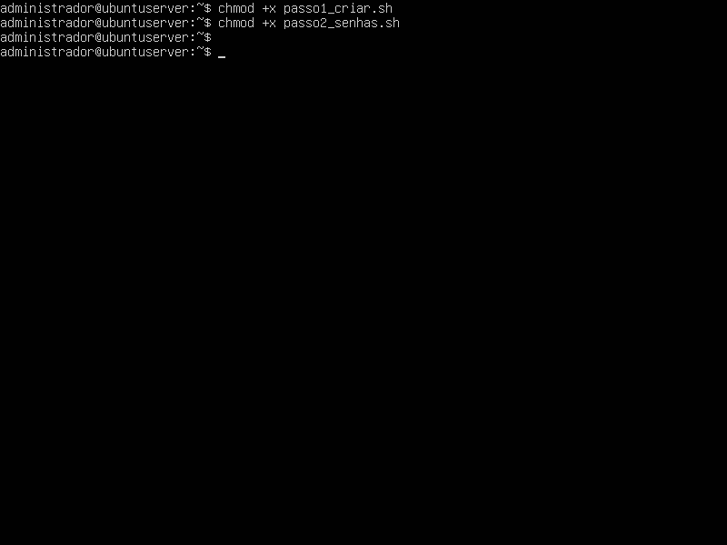
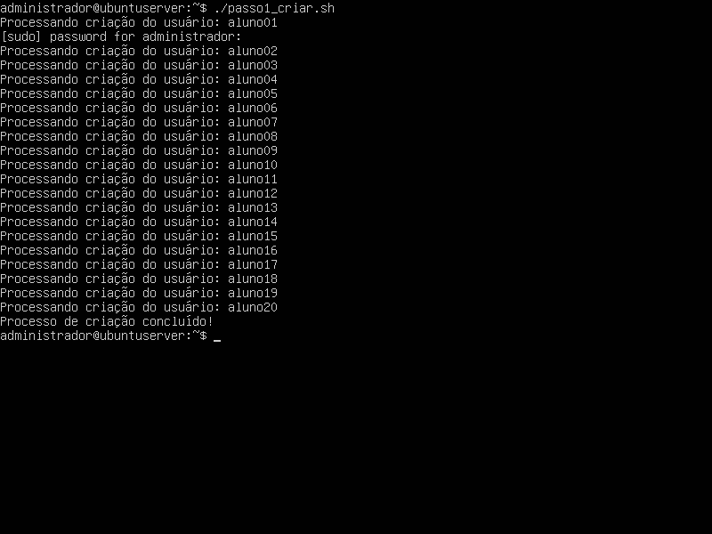
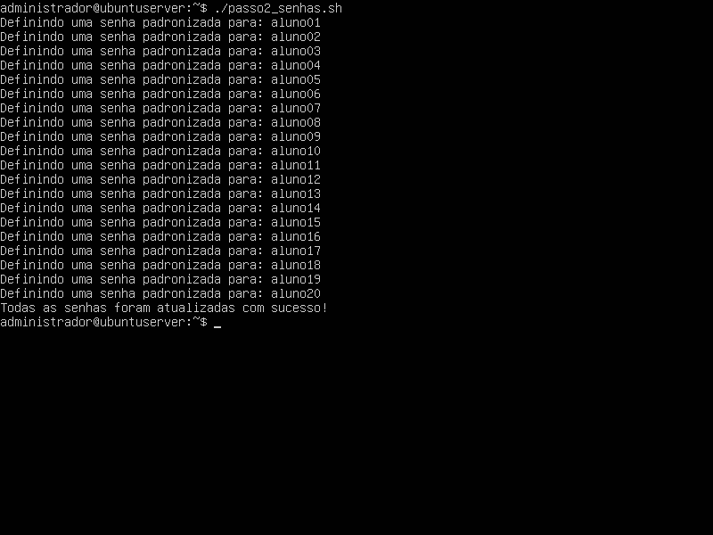
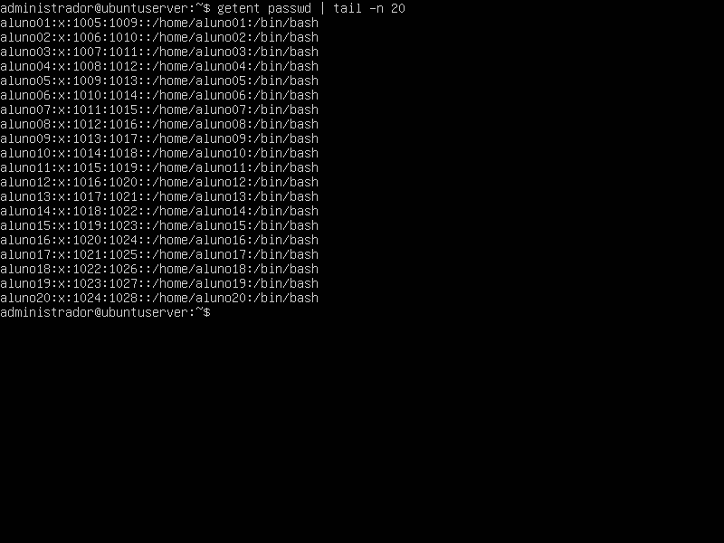
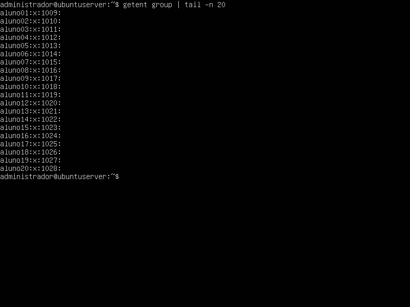
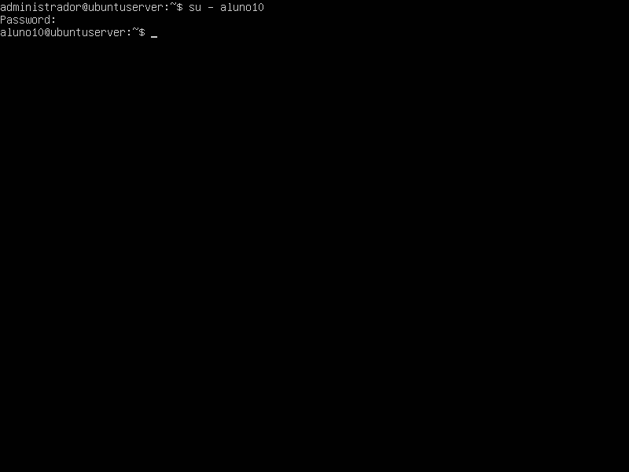

## 1. Identificação:
* **Disciplina:** Laboratório de Sistemas Operacionais e Redes (LSOR)
* **Curso:** Bacharelado em Sistemas de Informação (BSI)
* **Repositório:** `labredes-bsi-2026.02`
* **Estudante:** José Pedro Costa Duda
* **Data da Execução:** 26/08/2026

---

## 2. Objetivo:
Como objetivos principais dessa prática estão: Criar novos arquivos, bem como utilizar o editor de texto nano e seus comandos para manipular, salvar e automatizar arquivos em Shell.

---

## 3. Ambiente do Laboratório:

* **Computador Host:**
  * **Sistema Operacional:** Windows
  * **Caminho da VM:** `C:\2026\BSI\VM\José Pedro Costa Duda\ubuntu_server`
  * **Arquivo ISO Utilizado:** `ubuntu-26.04-live-server-amd64.iso`
* **Máquina Virtual:**
  * **Software de Virtualização:** Oracle VM VirtualBox
  * **Nome da VM:** `ubuntu_server`
  * **Memória RAM:** 2048 MB
  * **CPU:** 1 CPU
  * **Disco Virtual:** 32 GB (VDI, Dinamicamente Alocado)

---

## 4. Procedimento Realizado:

1. **Criação do arquivo 1:** Nesta etapa foi realizada a criação do primeiro arquivo 'usuarios.txt' contendo um total de 20 usuários, que vai basear os próximos passos da prática.

2. **Criação do Script 1:** Em seguida foi criado o script Shell 'passo1_criar.sh' responsável por automatizar a criação dos perfis de usuário lendo o arquivo 'usuarios.txt', invocando o /bin/bash.  

3. **Criação do Script 2:** Criado o segundo script 'passo2_senhas.sh' responsável por automatizar a criação das senhas para cada novo usuário, utilizando o próprio login como senha.  

4. **Permissão de execução:** Antes de executar os scripts criados anteriormente, foi necessário conceder a permissão de execução através do comando 'chmod +x <nome_do_script>.sh', já que arquivos recém criados são bloqueados por questões de segurança.

5. **Execução dos Scripts:** Executados os scripts 1 e 2 (em sequência), no formato './<nome_do_script>.sh'.

---

## 5. Testes e Evidências:

### 5.1. Permissão de execução:

### 5.2. Execução do Script 'passo1_criar.sh':

### 5.3. Execução do Script 'passo2_senhas.sh':

### 5.4. Execução do Comando 'getent passwd | tail -n 20':

### 5.5. Execução do Comando 'getent group | tail -n 20':

### 5.6. Teste de Login em usuário aleatório (aluno10 foi o escolhido):

---

## 6. Problemas Encontrados e Soluções:

* **Problema:**  Nenhum problema foi encontrado na execução da atividade.
* **Solução:** —

---

## 7. Conclusão:
Nesta prática, aprendi novos comandos para realizar leitura e manipulação de arquivos, a ferramenta nano como um poderoso editor de textos e os scripts shell da atividade prática como um facilitador na automação de tarefas, deixando de lado a dificuldade manual de criação de novos usuários.
