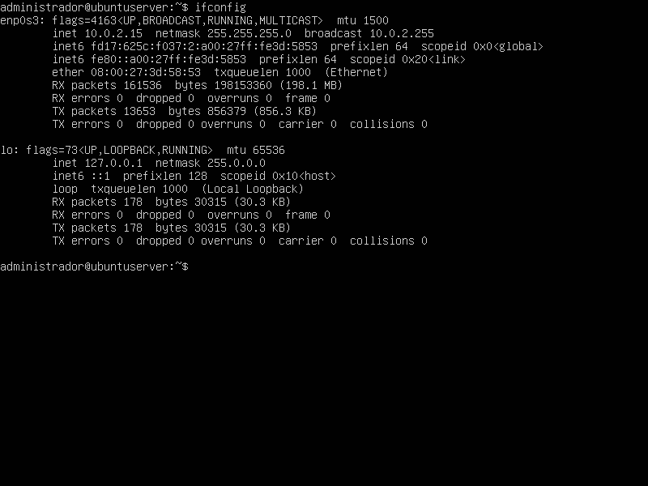
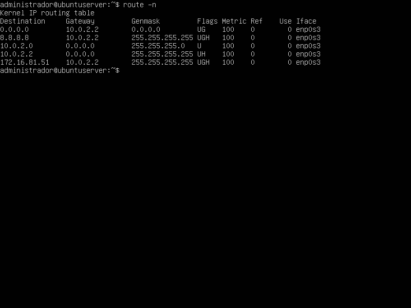
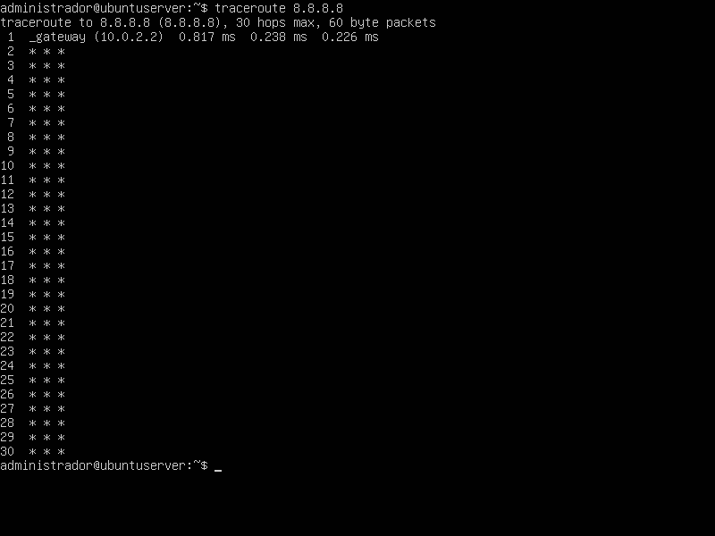
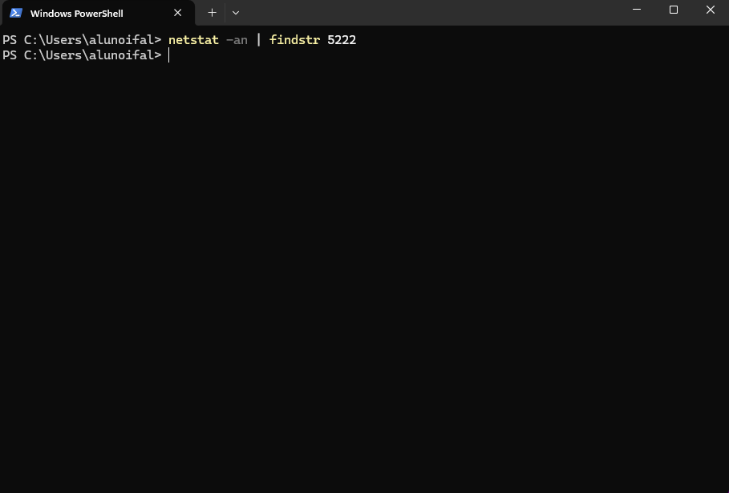
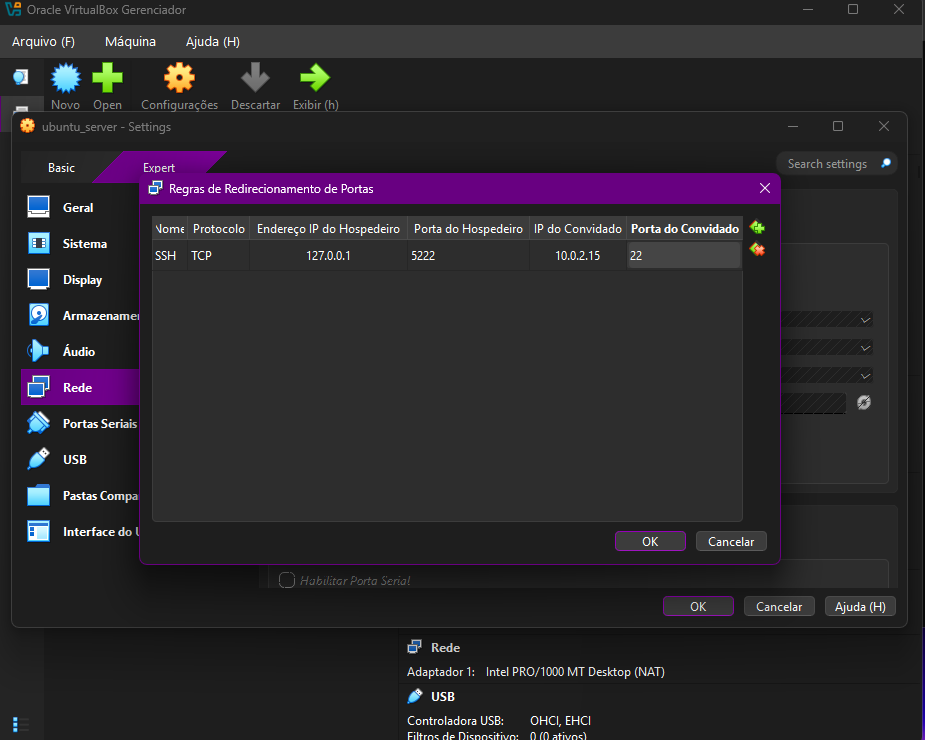
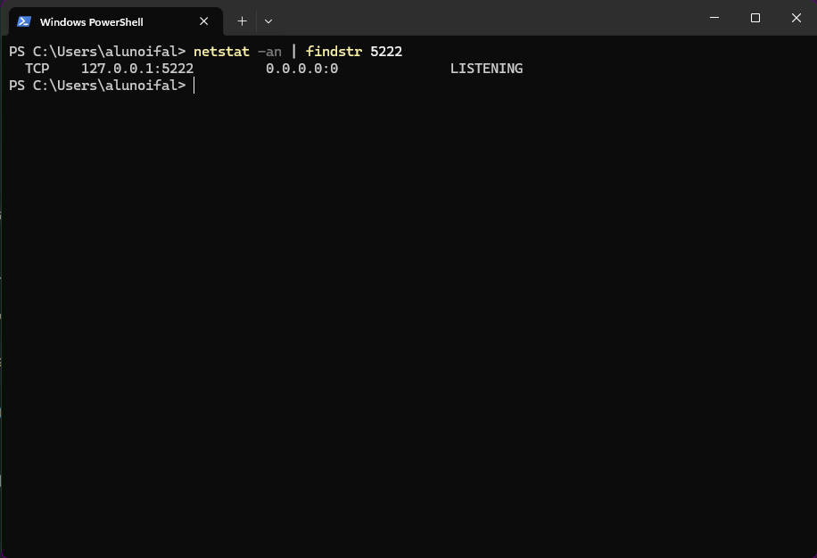
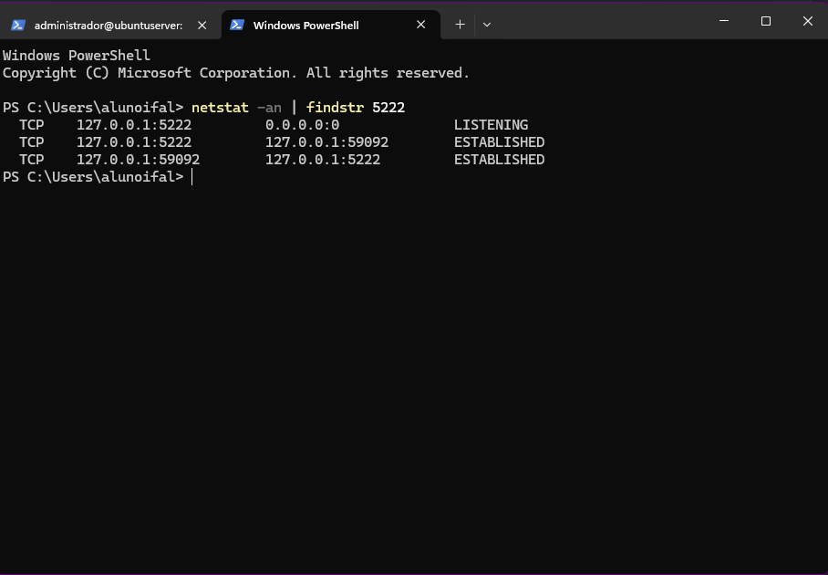

## 1. Identificação
* **Disciplina:** Laboratório de Sistemas Operacionais e Redes (LSOR)
* **Curso:** Bacharelado em Sistemas de Informação (BSI)
* **Repositório:** `labredes-bsi-2026.02`
* **Estudante:** José Pedro Costa Duda
* **Data da Execução:** 14/08/2026

---

## 2. Objetivo
Para a execução desta atividade, conectar o terminal Windows da máquina física ao SSH (Secure Shell), é necessário criar uma Regra de Redirecionamento de Portas no VirtualBox. Por padrão, a inteface de rede da VM é configurada
em modo NAT (Network Adress Translation), onde cria uma rede privada e virtual para a máquina. A máquina virtual consegue navegar na internet e acessar rede externa usando a conexão do Host Windows, mas esse Host não consegue acessar
o IP da máquina, pois este pertence a uma sub-rede privada isolada pelo roteador da VM.

---

## 3. Ambiente do Laboratório

* **Computador Host:**
  * **Sistema Operacional:** Windows
  * **Caminho da VM:** `C:\2026\BSI\VM\José Pedro Costa Duda\ubuntu_server`
  * **Arquivo ISO Utilizado:** `ubuntu-26.04-live-server-amd64.iso`
* **Máquina Virtual:**
  * **Software de Virtualização:** Oracle VM VirtualBox
  * **Nome da VM:** `ubuntu_server`
  * **Memória RAM:** 2048 MB
  * **CPU:** 1 CPU
  * **Disco Virtual:** 32 GB (VDI, Dinamicamente Alocado)

---

## 4. Procedimento Realizado

### 4.1. **Instalação de utilitários:** Com o comando 'netpan status' é possível ver a interface enp0s3 listada em modo DHCP e o endereço ip como 10.0.2.15/24. Antes da instalação dos pacotes, verifiquei se o serviço
   SSH já estava instalado com o comando 'dpkg -l | grep openssh-server' e estava. Executei os comandos 'sudo apt update' e 'sudo apt install -y net-tools e traceroute' para instalar os utilitários da atividade.

### 4.2. **Inspeção na VM:** Após a instalação dos pacotes, usei o comando 'ipconfig' para obter informações sobre a interface enp0s3 (como máscara de subrede e o endereço IPV4); em seguida, com o comando 'route -n'
   para localizar o Gateway Padrão da VM e o comando 'w' para verificar quais usuários estão conectados e que terminais estão utilizando.
   
### 4.3. **Inspeção no Host Windows:** No PowerShell do Windows, executei o comando 'ipconfig' para comparar os endereços MAC do Host e da VM; depois, executei o comando 'netstat -an | findstr 5222' para verificar se existiam
   conexões abertas e as portas TCP/UDP em escuta. 

### 4.4. **Configuração do Redirecionamento de Portas:** Nas configurações de rede da máquina virtual no VirtualBox, criei a nova regra conforme o roteiro de aula informando: o nome SSH, protocolo TCP, o IP e porta do 
Host (127.0.0.1	5222, respectivamente) e o IP e Porta da VM (10.0.2.15 e 22, respectivamente).

---

## 5. Testes e Evidências

### 5.1. Diagnosticos do Linux Guest:

---

---

---

### 5.2. Diagnóstico das portas do Windows Host:

---

---

---

---

### 5.3. Conexão Remota:

---

## 6. Problemas Encontrados e Soluções

* **Problema:** Nenuhm problema encontrado durante a execução da atividade.
* **Solução:** ---

---

## 7. Conclusão
A realização desta atividade permite compreender de forma prática o funcionamento da comunicação entre uma máquina física e uma máquina virtual utilizando SSH em 
um ambiente de rede configurado em modo NAT no VirtualBox através do redirecionamento de portas. Essa configuração demonstrou como uma porta do Host Windows pode ser 
associada a uma porta específica da máquina virtual, possibilitando o acesso ao serviço SSH no Host Windows mesmo com a VM possuindo uma sub-rede privada e sendo protegida
pelo roteador próprio do VirtualBox.
