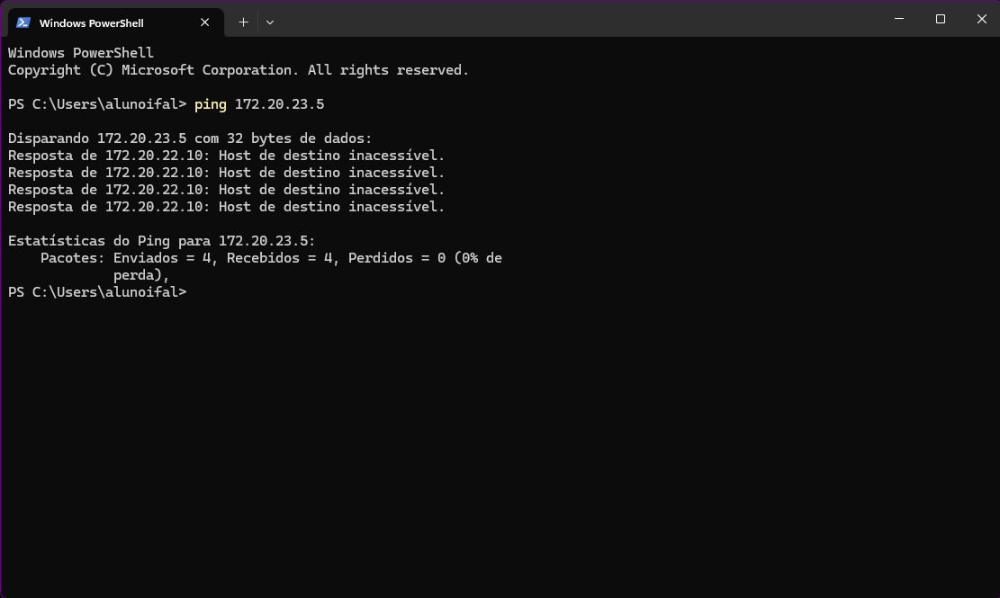
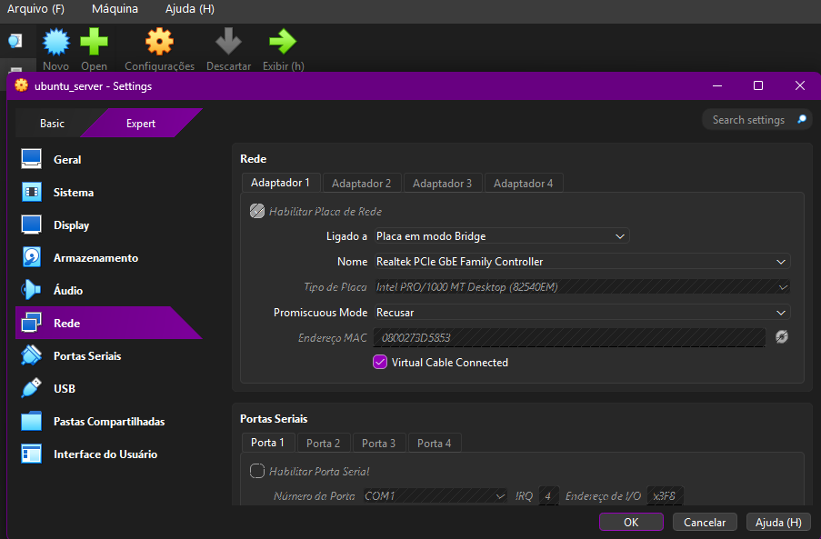
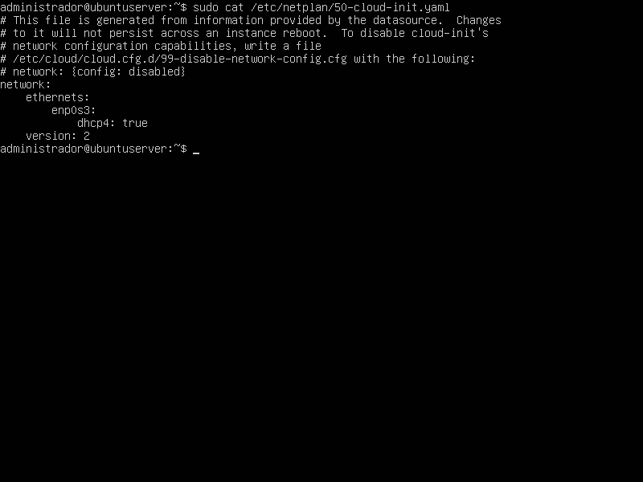
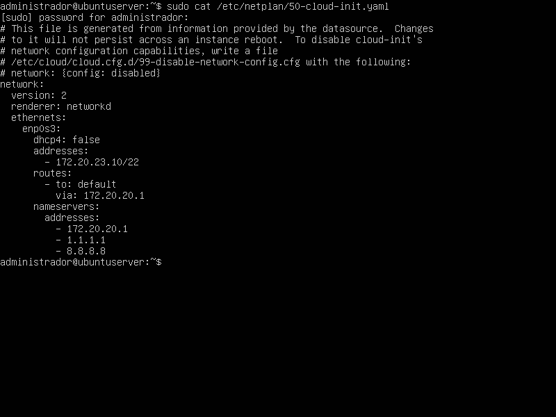
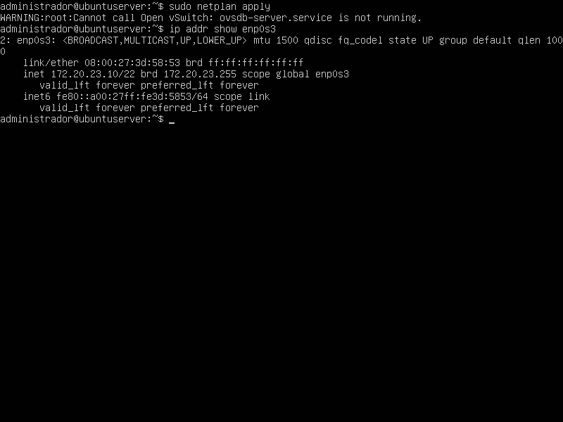
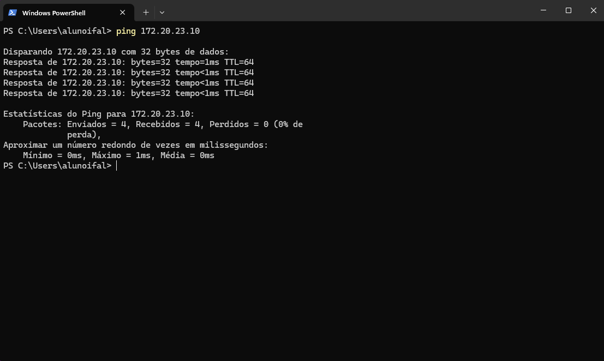
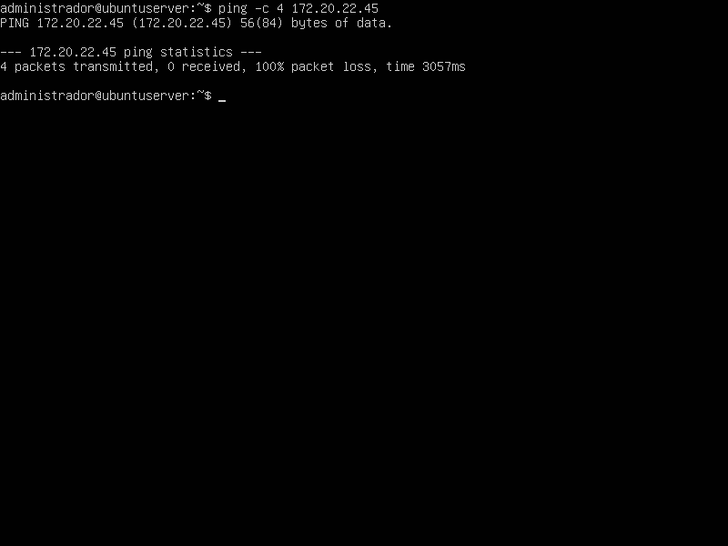
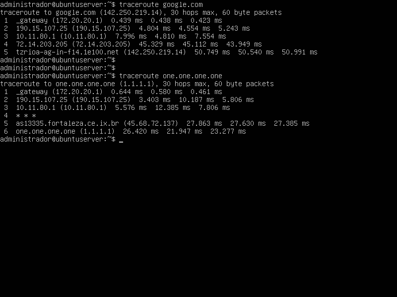

## 1. Identificação
* **Disciplina:** Laboratório de Sistemas Operacionais e Redes (LSOR)
* **Curso:** Bacharelado em Sistemas de Informação (BSI)
* **Repositório:** `labredes-bsi-2026.02`
* **Estudante:** José Pedro Costa Duda
* **Data da Execução:** 23/08/2026

---

## 2. Objetivo
O objetivo desta atividade é transformar a atual configuração de rede da máquina virtual (Modo NAT) para o modo de Placa em Bridge, que permite
que a máquina virtual faça parte direta da rede física do laboratório. Além disso, faremos a configuração do arquivo netplan responsável por 
configurar, entre muitas coisas, o IP estático da nossa VM.

---

## 3. Ambiente do Laboratório

* **Computador Host:**
  * **Sistema Operacional:** Windows
  * **Caminho da VM:** `C:\2026\BSI\VM\José Pedro Costa Duda\ubuntu_server`
  * **Arquivo ISO Utilizado:** `ubuntu-26.04-live-server-amd64.iso`
* **Máquina Virtual:**
  * **Software de Virtualização:** Oracle VM VirtualBox
  * **Nome da VM:** `ubuntu_server`
  * **Memória RAM:** 2048 MB
  * **CPU:** 1 CPU
  * **Disco Virtual:** 32 GB (VDI, Dinamicamente Alocado)

---

## 4. Procedimento Realizado

### 4.1. **Busca do IP livre:** 
  Através do PowerShell da máquina física (Windows Host) foi realizada a busca de um IP que apresentasse 'Host de destino inacessível'.
  O IP escolhido foi o de número '172.20.23.10'.
  
### 4.2. **Configuração do VirtualBox:** 
  Nas configurações de rede do VirtualBox, foi realizado o procedimento de troca da configuração do modo NAT para Placa em Modo Ponte (Bridge),
  levando em consideração os critérios solicitados na etapa (selecionando o Nome da placa de rede física do Host).

### 4.3. **Edição do arquivo .yaml:** 
  Utilizando o editor nano da máquina virtual, foi realizado a alteração do arquivo '.yaml' presente no diretório /etc/netplan, mudando informações
  como: endereço de IP da máquina virtual, a máscara de sub-rede, o Gateway Padrão e servidores DNS.
  
### 4.4. **Aplicação de regras:**
  Após a visualização do arquivo devidamente editado, foi utilizado o comando 'netplan apply' para garantir essa nova configuração de rede. Com
  o comando 'ip addr show enp0s3' pude verificar se o endereço IP da máquina virtual foi realmente alterado e a regra devidamente aplicada.
  
---

## 5. Testes e Evidências

### 5.1. Verificação do IP disponível:

---

### 5.2. Configuração do VirtualBox:

---

### 5.3. Arquivo antes da edição:

---

### 5.4. Arquivo após edição:

---

### 5.5. Aplicação de regra/Verificação do novo IP:

---

### 5.6. Teste de Ping (Host Windows):

---

### 5.7. Teste de Ping (Máquina Virtual):

---

### 5.8. Testes de Traceroute (Google e one.one.one.one):

---

## 6. Problemas Encontrados e Soluções

* **Problema:** Nome do arquivo do diretório /etc/netplan estava diferente do apresentado no roteiro de aula.
* **Solução:** Por ser o único arquivo presente no diretório e ao visualizar antes da edição, apenas fiz a mudança do conteúdo interno para
  prosseguir com a atividade.

---

## 7. Conclusão
A prática da atividade permitiu a compreensão da configuração de uma máquina virtual em uma rede utilizando modo Bridge 
(Placa em Modo Ponte) e IP estático. A alteração do modo NAT para Bridge fez com que a máquina virtual passasse a participar 
diretamente da rede física, recebendo uma configuração compatível com a rede do laboratório. O uso de IP estático exige que este esteja
disponível para evitar conflitos com outras máquinas e tem como vantagens: o acesso "remoto" de outros dispositivos daquela rede (sejam 
bancos de dados, servidores Web, aplicações corporativas etc).
