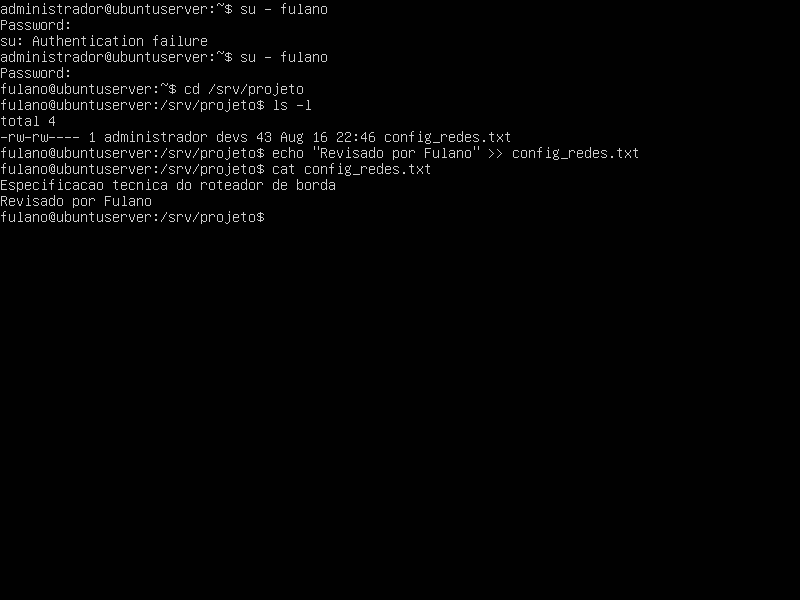
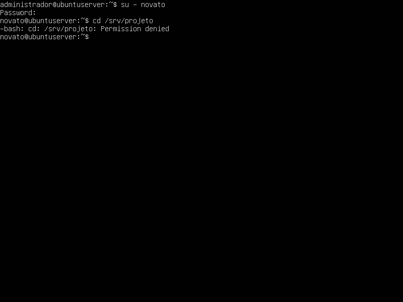
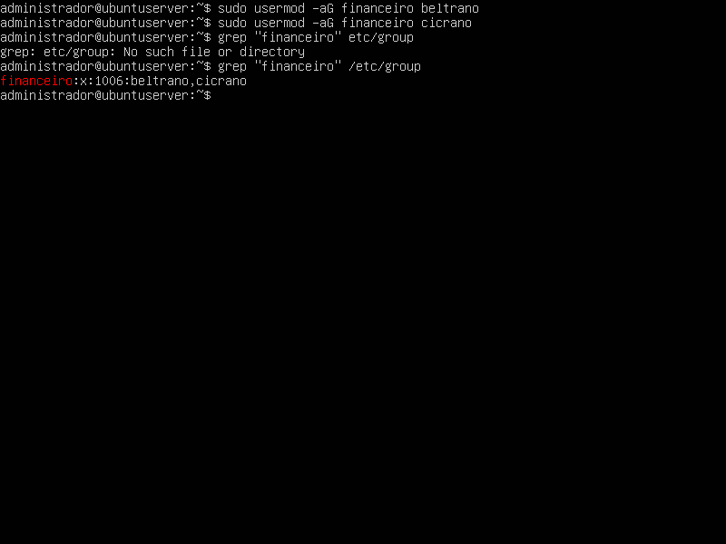
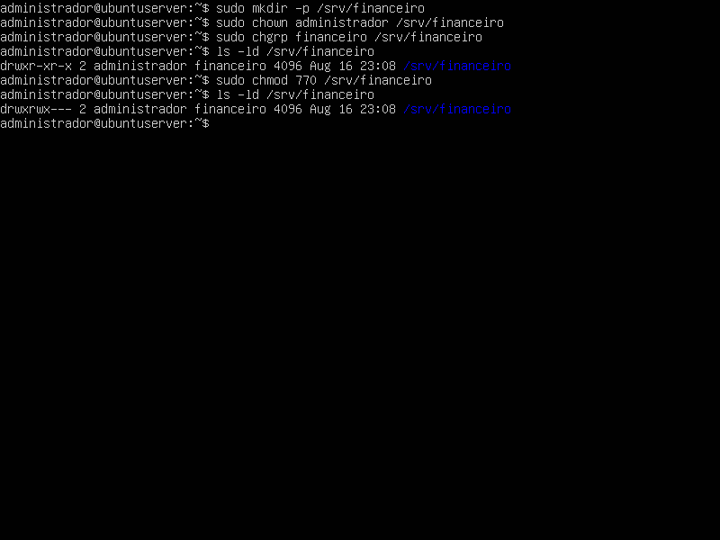
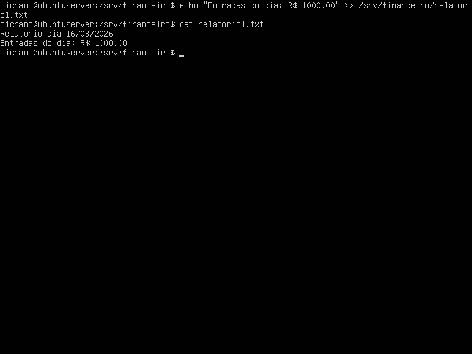

## 1. Identificação
* **Disciplina:** Laboratório de Sistemas Operacionais e Redes (LSOR)
* **Curso:** Bacharelado em Sistemas de Informação (BSI)
* **Repositório:** `LABSO_REDES`
* **Estudante:** José Pedro Costa Duda
* **Data da Execução:** 15/08/2026

---

## 2. Objetivo
Como objetivos principais dessa prática estão: Aprender a como criar grupos no sistema linux, bem como atribuir participantes e manipular as permissões dos níveis de usuário.

---

## 3. Ambiente do Laboratório

* **Computador Host:**
  * **Sistema Operacional:** Windows
  * **Caminho da VM:** `C:\2026\BSI\VM\José Pedro Costa Duda\ubuntu_server`
  * **Arquivo ISO Utilizado:** `ubuntu-26.04-live-server-amd64.iso`
* **Máquina Virtual:**
  * **Software de Virtualização:** Oracle VM VirtualBox
  * **Nome da VM:** `ubuntu_server`
  * **Memória RAM:** 2048 MB
  * **CPU:** 1 CPU
  * **Disco Virtual:** 32 GB (VDI, Dinamicamente Alocado)

---

## 4. Procedimento Realizado

1. **Novos usuários:** Criados os usuários Fulano, Cicrano, Beltrano e Novato através do comando 'sudo adduser [nomeDoUsuario]', atribuindo-os uma senha de acesso.

2. **Grupos de trabalho:** Criados os grupos de trabalho 'devs' (para acompanhar a prática da aula) e 'financeiro' (para o exercício de fixação) utilizando o comando 
o comando 'sudo groupadd [nomeDoGrupo]', incluindo os usuários criados na etapa anterior com o comando 'sudo usermod -aG [nomeDoGrupo] [nomeDoUsuario]'.

3. **Pastas:** Criadas as pastas/diretórios '/srv/projeto' e '/srv/relatorio', como administrador, utilizando o comando 'sudo mkdir -p [nomeDiretorio]'.

4. **Alterações nos diretórios/pastas:**
   * Atribuído o usuário 'administrador' como o proprietário dos diretórios '/srv/projeto' e '/srv/relatorio' através do comando 'sudo chown administrador [nomeDiretorio]'.
   * Atribuídos os grupos 'devs' e 'financeiro' aos seus respectivos diretórios, através do comando 'sudo chgrp devs [nomeDiretorio]'.

5. **Permissões de acesso (via regra Octal):** Atribuídos os controles de acesso para os usuários, incluindo o administrador, através do comando 'sudo chmod 770 [nomeDiretorio]'.
   * Nota: Os controles de acesso variam entre os usuários de acordo com o exercício ou teste proposto.

6. **Arquivos de teste:** Criados os arquivos de testes 'config_redes.txt' e 'relatorio1.txt' para o desenvolvimento dos testes e exercício.

---

## 5. Testes e Evidências

### 5.1. Teste A: Validação com o usuário do grupo devs (fulano)

### 5.2. Teste B: Validação com usuário externo (novato)

### 5.3. Exercício de Fixação

#### 5.3.1 Grupo Financeiro:

#### 5.3.2 Diretório de relatórios do Financeiro

#### 5.3.3 Teste de Cicrano:

#### 5.3.4 Teste de Novato:

---

## 6. Problemas Encontrados e Soluções

* **Problema:** Não foram encontrados problemas na execução da prática.
* **Solução:** [---].

## 7. Conclusão
